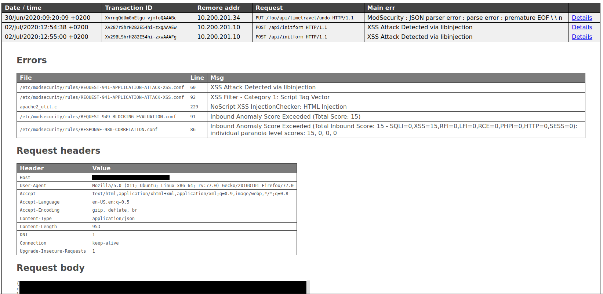

# ModSecurity Report generator

[ModSecurity](https://modsecurity.org/), sometimes called Modsec, is an
open-source web application firewall (WAF) for Apache, Microsoft IIS and
Nginx. `mod_sec_report` converts mod_security violation logging in JSON format
to an HTML page for human-friendly viewing.

Screenshot of an example report:

## Installation

mod_sec_report requires **Python v3**.

Install the dependencies:

    $ pip install -r requirements.txt

## Usage

mod_sec_report *only* works with logging in JSON format! You can enable JSON
logging with the `SecAuditLogFormat` setting in mod_security:

        SecAuditLogFormat JSON
        SecAuditLog /var/log/apache2/modsec-audit.log

Usage:

    usage: mod_sec_report [-h] LOGFILES [LOGFILES ...]

    ModSecurity Report generator

    positional arguments:
      LOGFILES    ModSec log files in JSON fmt

    optional arguments:
      -h, --help  show this help message and exit

mod_sec_report understands both plain text log files as well as logrotated
`.gz` log files. It automatically orders log entries by date and time, so the
order in which you specify the log files doesn't matter.

Example:

    ./mod_sec_report /var/log/apache2/*modsec* > modsec-audit.html
